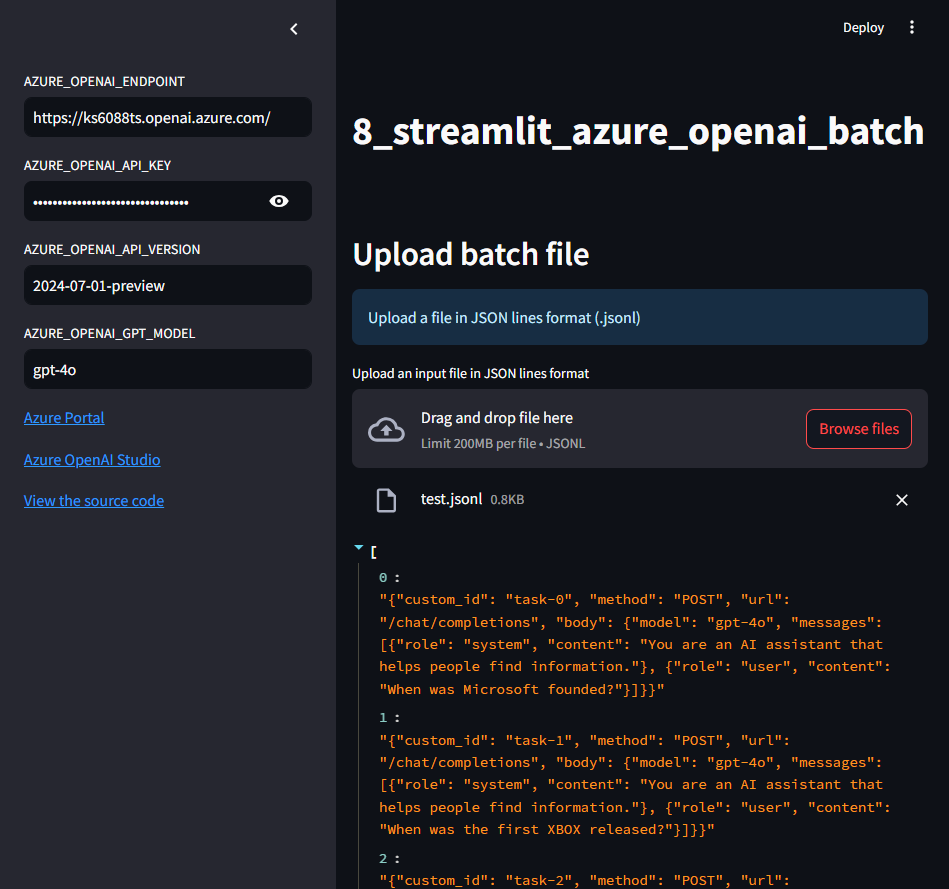

[](https://github.com/ks6088ts-labs/workshop-azure-openai/actions/workflows/test.yaml?query=branch%3Amain)
[](https://github.com/ks6088ts-labs/workshop-azure-openai/actions/workflows/docker.yaml?query=branch%3Amain)
[](https://github.com/ks6088ts-labs/workshop-azure-openai/actions/workflows/docker-release.yaml)
[](https://github.com/ks6088ts-labs/workshop-azure-openai/actions/workflows/ghcr.yaml)

# workshop-azure-openai

This repository is for a workshop using Azure OpenAI Service.

## Prerequisites

To run all the projects in this repository, you need the followings.

- [Python 3.10+](https://www.python.org/downloads/)
- [Azure OpenAI Service](https://azure.microsoft.com/en-us/products/ai-services/openai-service)
- [Azure Cosmos DB](https://azure.microsoft.com/en-us/products/cosmos-db/)
- [Azure AI Search](https://azure.microsoft.com/en-us/products/ai-services/ai-search)

Here are the preferred tools for development.

- [Poetry](https://python-poetry.org/docs/#installation)
- [GNU Make](https://www.gnu.org/software/make/)

## Projects

| Project                                                                           | Description                                             | Image                                                                                    |
| --------------------------------------------------------------------------------- | ------------------------------------------------------- | ---------------------------------------------------------------------------------------- |
| [1_call_azure_openai_chat](./apps/1_call_azure_openai_chat/README.md)             | Call Azure OpenAI Service API from Python               | No Image                                                                                 |
| [2_streamlit_chat](./apps/2_streamlit_chat/README.md)                             | Create an Azure OpenAI Chat app using Streamlit         |                         |
| [3_call_azure_cosmos_db](./apps/3_call_azure_cosmos_db/README.md)                 | Call Azure Cosmos DB from Python                        | No Image                                                                                 |
| [4_streamlit_chat_history](./apps/4_streamlit_chat_history/README.md)             | Add feature to store chat history using Azure Cosmos DB |         |
| [5_streamlit_query_chat_history](./apps/5_streamlit_query_chat_history/README.md) | Search Chat History                                     |  |
| [6_call_azure_ai_search](./apps/6_call_azure_ai_search/README.md)                 | Call Azure AI Search from Python                        | No Image                                                                                 |
| [7_streamlit_chat_rag](./apps/7_streamlit_chat_rag/README.md)                     | Add RAG feature to Streamlit chat app                   |                      |
| [8_streamlit_azure_openai_batch](./apps/8_streamlit_azure_openai_batch/README.md) | Call Azure OpenAI Batch API with Streamlit              |  |
| [99_streamlit_examples](./apps/99_streamlit_examples/README.md)                   | Code samples for Streamlit                              |             |

## How to run

Referring to the [.env.template](.env.template) file, create a `.env` file in the same directory and set the required credentials.

### Local environment

```shell
# Create a virtual environment
$ python -m venv .venv

# Activate the virtual environment
$ source .venv/bin/activate

# Install dependencies
$ pip install -r requirements.txt

# Run the script (e.g. run 2_streamlit_chat)
$ python -m streamlit run apps/2_streamlit_chat/main.py
```

### Docker container

```shell
# Set Docker image name
## GitHub Container Registry
$ IMAGE=ghcr.io/ks6088ts-labs/workshop-azure-openai:latest
## Docker Hub
$ IMAGE=ks6088ts/workshop-azure-openai:latest

# run 2_streamlit_chat
$ docker run --rm \
    -p 8501:8501 \
    -v ${PWD}/.env:/app/.env \
    ${IMAGE} \
    python -m streamlit run ./apps/2_streamlit_chat/main.py
```
