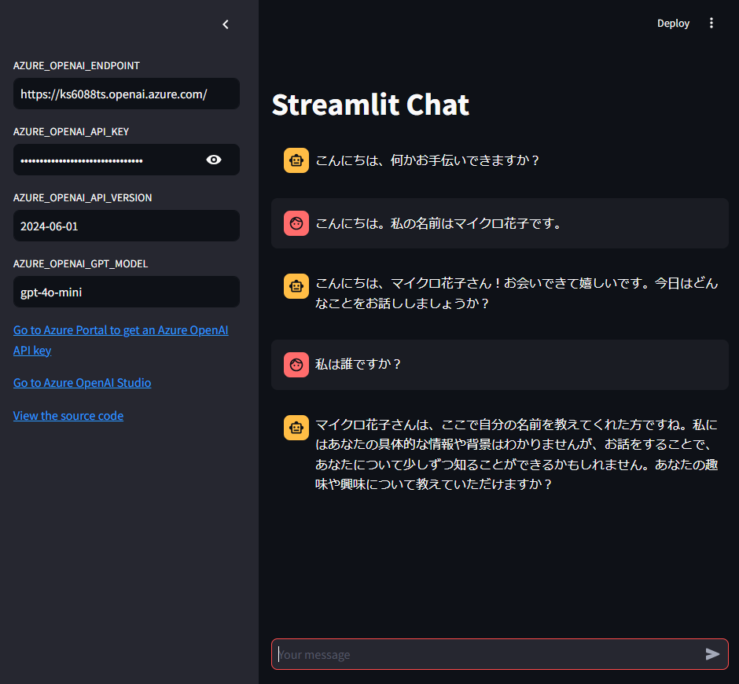

# Streamlit でチャットアプリを作成する

Streamlit を使って、Azure OpenAI Service を利用したチャットアプリを作成します。

## 前提条件

- Python 3.11+ がインストールされていること
- Azure OpenAI Service が利用できること
- Azure OpenAI Service の API キーが取得できていること

## 手順

1. Azure OpenAI Service の API キーを取得する
1. [.env.template](../../.env.template) をコピーして `.env` ファイルを作成する
1. `.env` ファイルに API キーを設定する
1. [main.py](./main.py) を実行する

```shell
# 仮想環境を作成してライブラリをインストールする
python -m venv .venv

# 仮想環境を有効化する
source .venv/bin/activate

# ライブラリをインストールする
pip install -r requirements.txt

# スクリプトを実行する
streamlit run ./apps/2_streamlit_chat/main.py
```

### 実行例

http://localhost:8501 にアクセスすると、以下のような画面が表示されます。



## 補足

本アプリでは、チャットのやり取りを保持するために、`st.session_state.messages` にメッセージを保持しています。
これはアプリケーションのプロセス側で、セッションごとにメッセージを保持するための仕組みです。セッションが終了するとメッセージは消えます。

## 参考資料

- [Your LLM code playground](https://streamlit.io/generative-ai)
