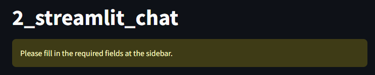
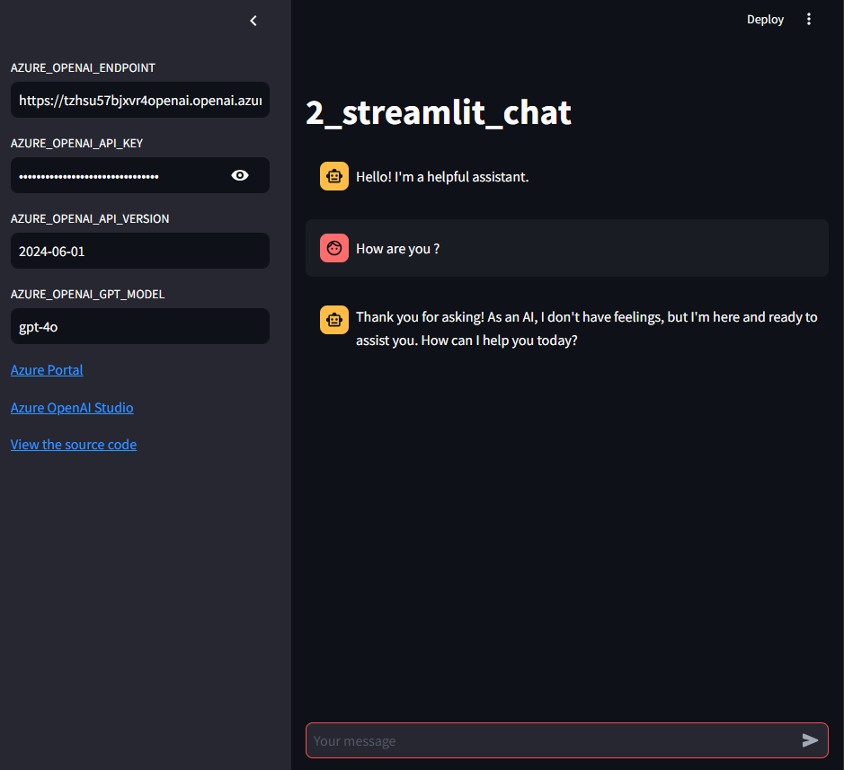

# Create an Azure OpenAI Chat app using Streamlit

This app demonstrates how to create a chat application using Azure OpenAI Service and Streamlit.

## Prerequisites

- Python 3.10 or later
- Azure OpenAI Service

## Usage

1. Get Azure OpenAI Service API key
1. Copy [.env.template](../../.env.template) to `.env` in the same directory
1. Set credentials in `.env`
1. Run [main.py](./main.py)

```shell
# Create a virtual environment
$ python -m venv .venv

# Activate the virtual environment
$ source .venv/bin/activate

# Install dependencies
$ pip install -r requirements.txt

# Run the script
$ python -m streamlit run apps/2_streamlit_chat/main.py
```

### Example

When you access `http://localhost:8501`, you will see the following screen.



To start a conversation, fill in the required fields in the sidebar and you will see the following screen.



## Note

This app uses `st.session_state.messages` to store messages for chat. This is a mechanism to store messages per session on the process side of the application. Messages will disappear when the session ends.

## References

- [Your LLM code playground](https://streamlit.io/generative-ai)
