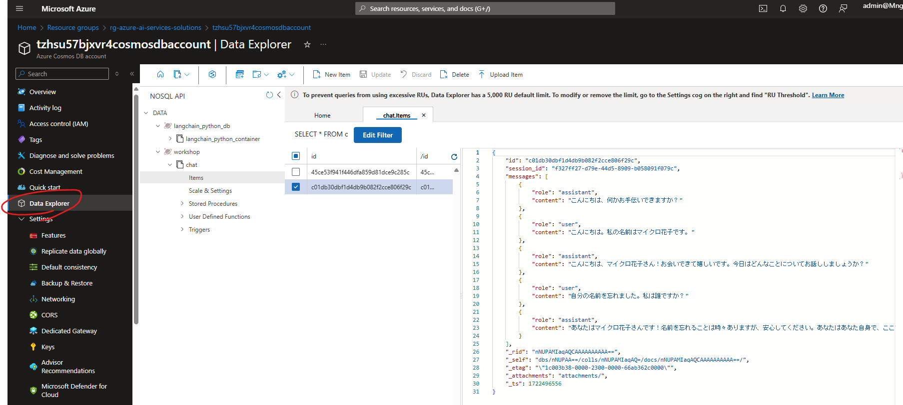

# Streamlit のチャットアプリに履歴機能を追加する

Cosmos DB を利用して、チャットの履歴を保存する機能を追加します。

## 前提条件

- Python 3.11+ がインストールされていること
- Azure OpenAI Service が利用できること
- Azure OpenAI Service の API キーが取得できていること
- Azure Cosmos DB のアカウントが作成されていること
- Azure Cosmos DB の接続文字列が取得できていること

## 手順

1. Azure OpenAI Service の API キーを取得する
1. Azure Cosmos DB の接続文字列を取得する
1. [.env.template](../../.env.template) をコピーして `.env` ファイルを作成する
1. `.env` ファイルに API キーを設定する
1. [main.py](./main.py) を実行する

```shell
# 仮想環境を作成してライブラリをインストールする
python -m venv .venv

# 仮想環境を有効化する
source .venv/bin/activate

# ライブラリをインストールする
pip install -r requirements.txt

# スクリプトを実行する
streamlit run ./apps/4_streamlit_chat_history/main.py
```

### 実行例

http://localhost:8501 にアクセスすると、以下のような画面が表示されます。


会話履歴は、Cosmos DB の Data Explorer から確認できます。



以下のようにチャットの履歴が保存されています。

**会話 1 ターン目**

```json
{
  "id": "45ce53f941f446dfa859d81dce9c285c",
  "session_id": "f327ff27-d79e-44d5-8909-b058091f079c",
  "messages": [
    {
      "role": "assistant",
      "content": "こんにちは、何かお手伝いできますか？"
    },
    {
      "role": "user",
      "content": "こんにちは。私の名前はマイクロ花子です。"
    },
    {
      "role": "assistant",
      "content": "こんにちは、マイクロ花子さん！お会いできて嬉しいです。今日はどんなことについてお話ししましょうか？"
    }
  ],
  "_rid": "nNUPAMIaqAQBAAAAAAAAAA==",
  "_self": "dbs/nNUPAA==/colls/nNUPAMIaqAQ=/docs/nNUPAMIaqAQBAAAAAAAAAA==/",
  "_etag": "\"1c003a38-0000-2300-0000-66ab36150000\"",
  "_attachments": "attachments/",
  "_ts": 1722496533
}
```

**会話 2 ターン目**

```json
{
  "id": "c01db30dbf1d4db9b082f2cce806f29c",
  "session_id": "f327ff27-d79e-44d5-8909-b058091f079c",
  "messages": [
    {
      "role": "assistant",
      "content": "こんにちは、何かお手伝いできますか？"
    },
    {
      "role": "user",
      "content": "こんにちは。私の名前はマイクロ花子です。"
    },
    {
      "role": "assistant",
      "content": "こんにちは、マイクロ花子さん！お会いできて嬉しいです。今日はどんなことについてお話ししましょうか？"
    },
    {
      "role": "user",
      "content": "自分の名前を忘れました。私は誰ですか？"
    },
    {
      "role": "assistant",
      "content": "あなたはマイクロ花子さんです！名前を忘れることは時々ありますが、安心してください。あなたはあなた自身で、ここでお話しするためにいます。他に何かお手伝いできることがあれば教えてください！"
    }
  ],
  "_rid": "nNUPAMIaqAQCAAAAAAAAAA==",
  "_self": "dbs/nNUPAA==/colls/nNUPAMIaqAQ=/docs/nNUPAMIaqAQCAAAAAAAAAA==/",
  "_etag": "\"1c003b38-0000-2300-0000-66ab362c0000\"",
  "_attachments": "attachments/",
  "_ts": 1722496556
}
```
