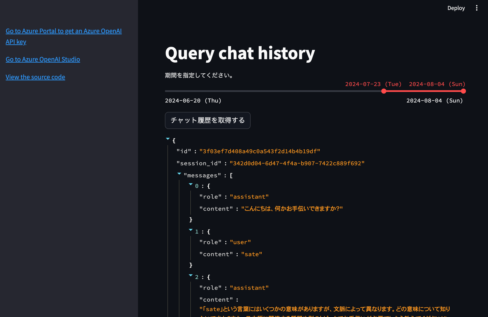

# Streamlit のチャットアプリの履歴機能を検索する

[4_streamlit_chat_history](../4_streamlit_chat_history/) で蓄積されたチャットの履歴を検索するためのアプリケーションです。

## 前提条件

- Python 3.11+ がインストールされていること
- Azure Cosmos DB のアカウントが作成されていること
- Azure Cosmos DB の接続文字列が取得できていること

## 手順

1. Azure Cosmos DB の接続文字列を取得する
2. [.env.template](../../.env.template) をコピーして `.env` ファイルを作成する
3. `.env` ファイルに API キーを設定する
4. [main.py](./main.py) を実行する

```shell
# 仮想環境を作成してライブラリをインストールする
python -m venv .venv

# 仮想環境を有効化する
source .venv/bin/activate

# ライブラリをインストールする
pip install -r requirements.txt

# スクリプトを実行する
streamlit run ./apps/5_streamlit_query_chat_history/main.py
```

### 実行例

http://localhost:8501 にアクセスすると、以下のような画面が表示されます。


