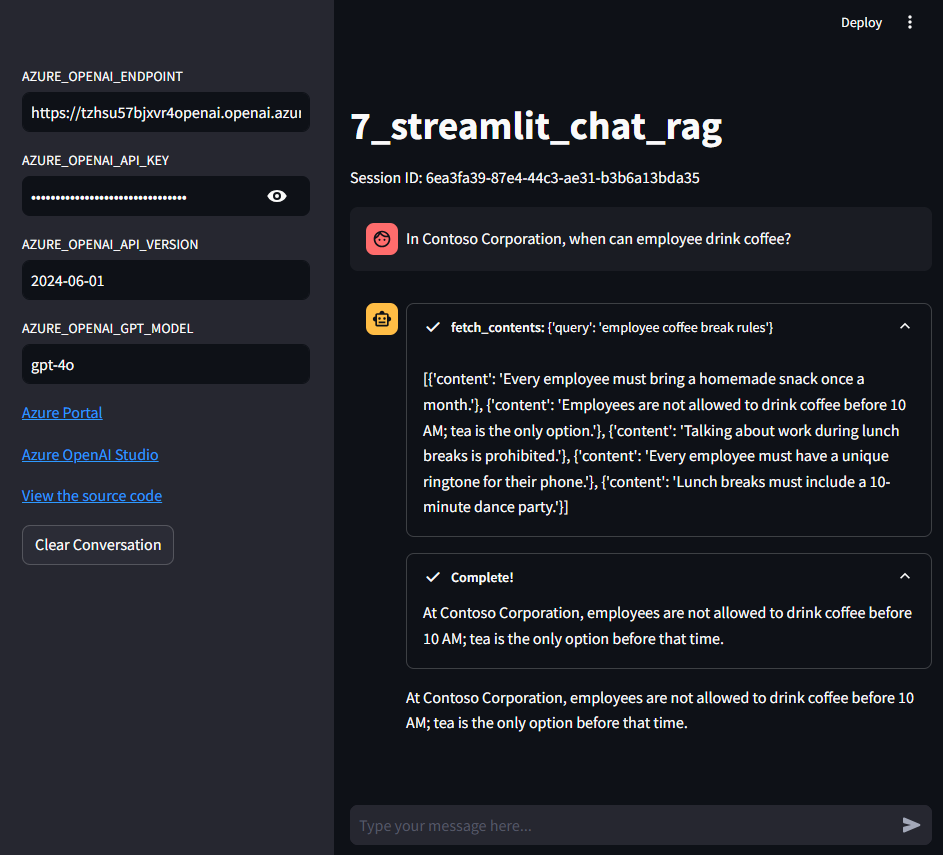

# Add RAG feature to Streamlit chat app

This app demonstrates how to add the Retrieval-Augmented Generation (RAG) feature to a Streamlit chat app.

## Prerequisites

- Python 3.10 or later
- Azure OpenAI Service
- Azure AI Search

## Overview

**What is RAG?**

Retrieval-Augmented Generation (RAG) is a model that combines the strengths of retrieval and generation models.
It uses a retriever to find relevant passages from a large corpus and then uses a generator to generate a response based on the retrieved passages.
In this way, RAG can generate more accurate and informative responses than traditional generation models.
This chapter provides an practical example of how to use RAG in a Streamlit chat app with the knowledge that you've learned in the following previous chapters.

- LLM: Azure OpenAI Service @ [1_call_azure_openai_chat](../1_call_azure_openai_chat/README.md)
- Chat app: Streamlit @ [2_streamlit_chat](../2_streamlit_chat/README.md)
- Search: Azure AI Search @ [6_call_azure_ai_search](../6_call_azure_ai_search/README.md)

This app just combines the above components to create a chat app with RAG feature.

**Introducing Function calling**


Function calling is a technical feature that allows you to connect LLM models to external tools and systems. This is useful for many things such as empowering AI assistants with capabilities, or building deep integrations between your applications and the models.

For example, if you want to implement chat app with RAG feature, you can use the function calling feature to connect the LLM model to external knowledge bases or search engines. This allows the model to retrieve relevant information from the knowledge base or search engine and generate a response based on that information.

**Introduce `AgentExecutor` to introduce function calling**

Implementing Function Calling from scratch can be complex and time-consuming. To make it easier, LangChain provides a feature called `AgentExecutor`.
AgentExecutor is a feature that allows you to connect LLM models to external tools and systems. This feature enables you to build deep integrations between your applications and the models, and empower AI assistants with capabilities.

## Usage

1. Get Azure OpenAI Service API key
1. Get Azure AI Search API key
1. Copy [.env.template](../../.env.template) to `.env` in the same directory
1. Set credentials in `.env`
1. Run [main.py](./main.py)

```shell
# Create a virtual environment
$ python -m venv .venv

# Activate the virtual environment
$ source .venv/bin/activate

# Install dependencies
$ pip install -r requirements.txt

# Run the script
$ python -m streamlit run apps/7_streamlit_chat_rag/main.py
```

### Example

Access `http://localhost:8501` and set the required fields in the sidebar to start a conversation.

When you send a question about Contoso Corporation, the chatbot will respond with an answer from Azure AI Search.



To see how the RAG feature works, watch the video below.

[](https://youtu.be/ummiu-rzYvs)

### How to customize

You can customize the chat app by modifying the following codes:

- [main.py](./main.py): `CUSTOM_SYSTEM_PROMPT` variable which defines the system prompt
- [tools/fetch_contents.py](./tools/fetch_contents.py): `fetch_contents` function comments which is passed to the LLM model
