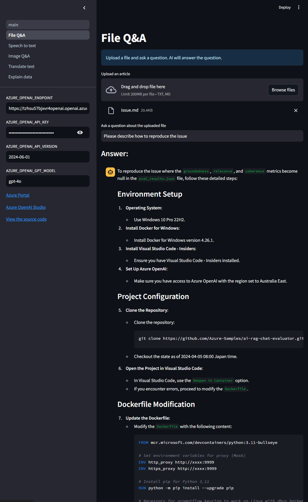
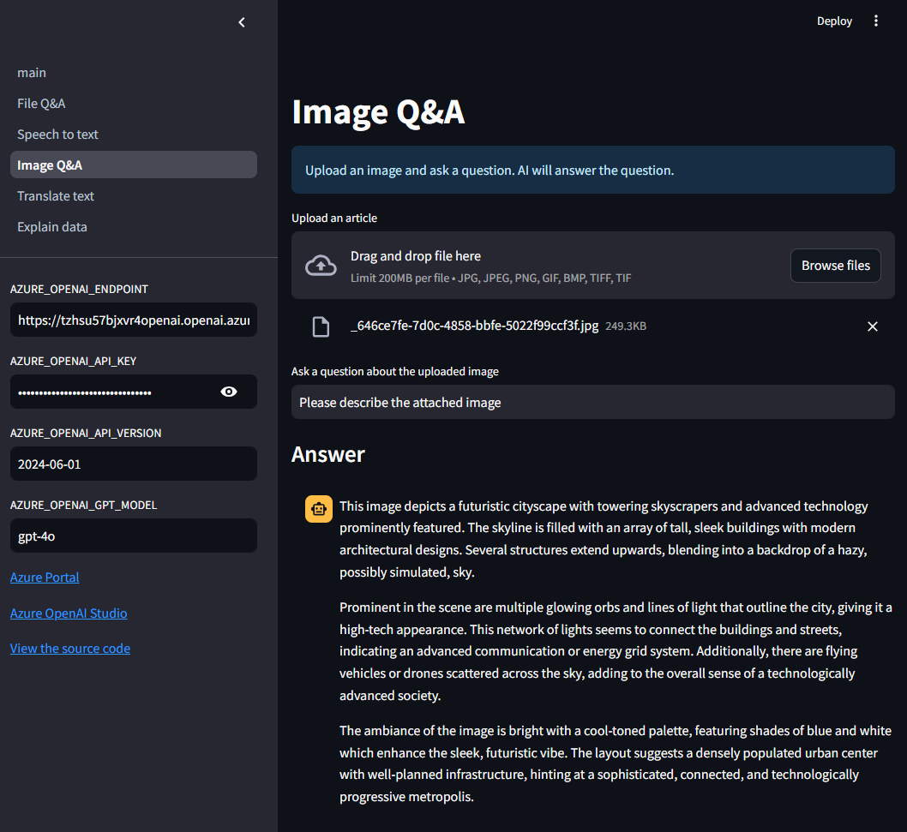
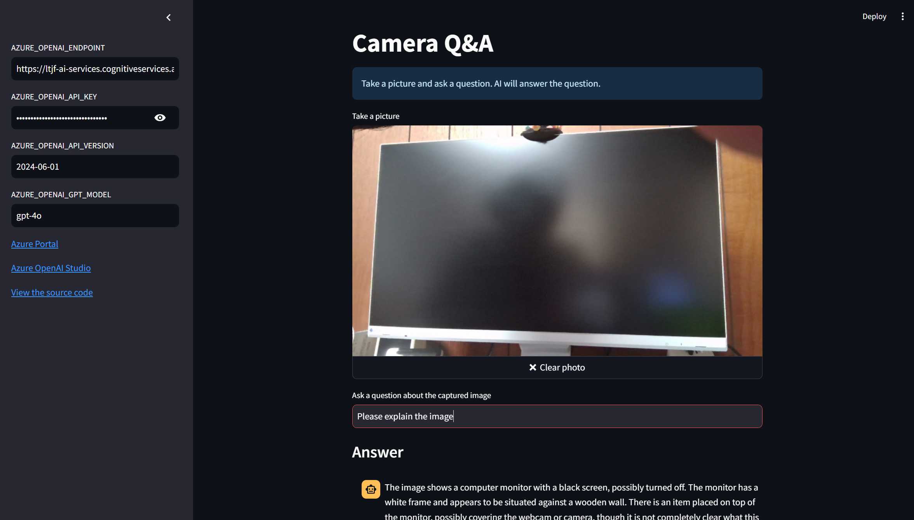
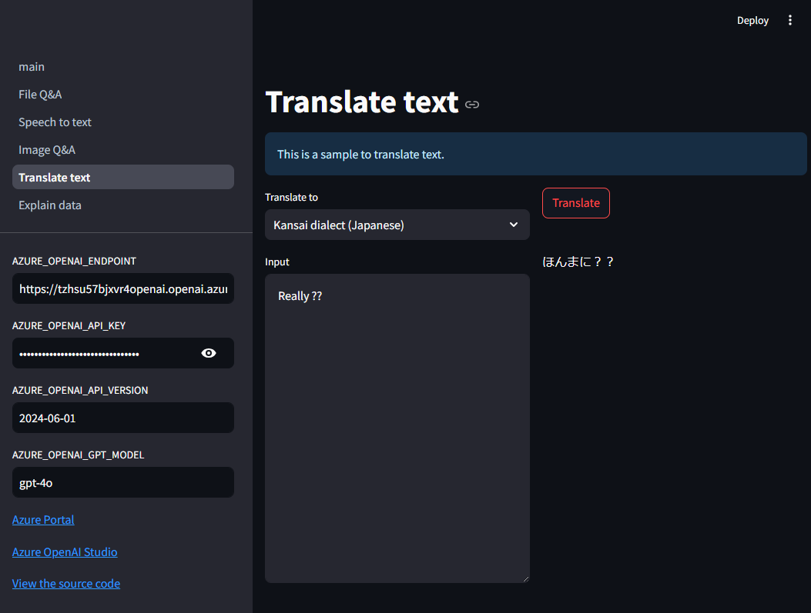
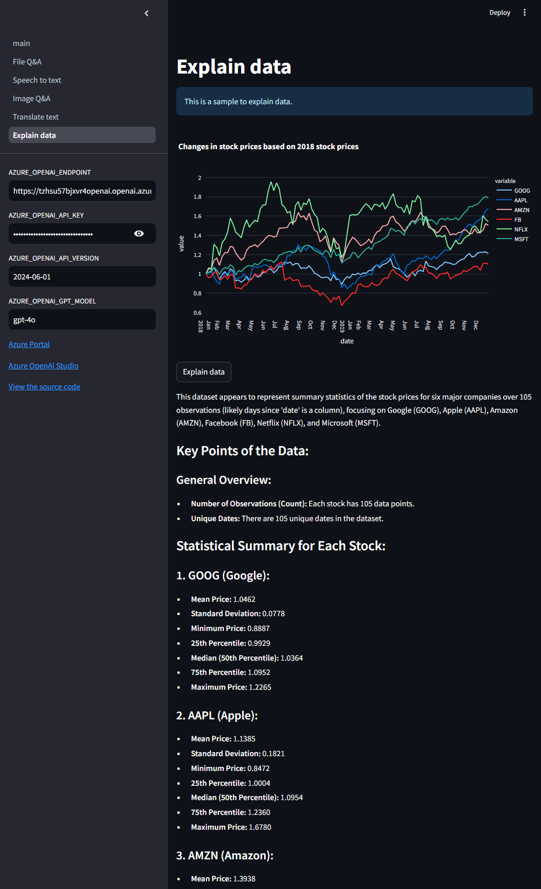
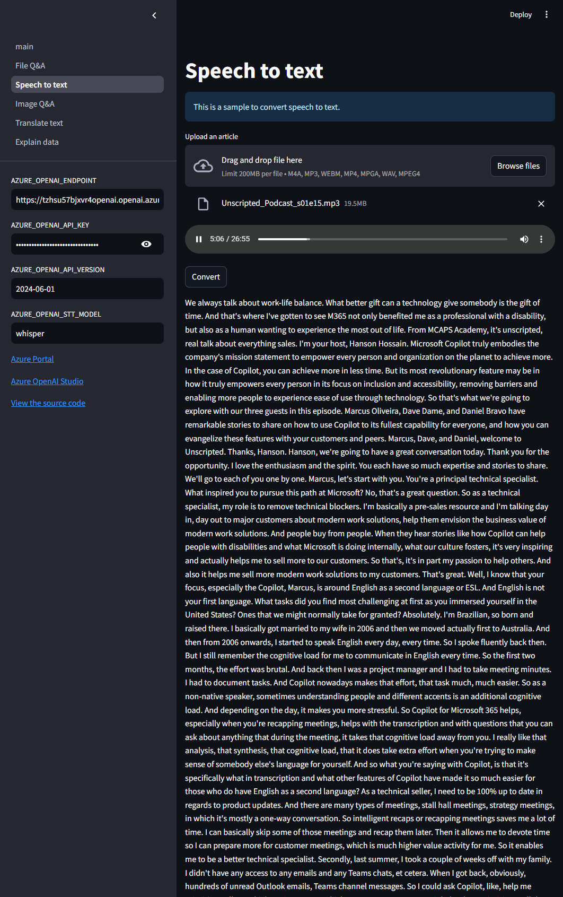

# Code samples for Streamlit

This app includes code samples for Streamlit. You can run the app and select the sample you want to run from the sidebar.

## Prerequisites

- Python 3.10 or later
- Azure OpenAI Service

## Usage

1. Get Azure OpenAI Service API key
1. Get Azure AI Search API key
1. Copy [.env.template](../../.env.template) to `.env` in the same directory
1. Set credentials in `.env`
1. Run [main.py](./main.py)

```shell
# Create a virtual environment
$ python -m venv .venv

# Activate the virtual environment
$ source .venv/bin/activate

# Install dependencies
$ pip install -r requirements.txt

# Run the script
$ python -m streamlit run apps/99_streamlit_examples/main.py
```

### Example

Access to http://localhost:8501 and select the sample you want to run from the sidebar.

#### 1. File Q&A



#### 2. Image Q&A



#### 3. Camera Q&A



#### 4. Translate text



#### 5. Explain data



#### 6. Speech to Text



## References

- [🎈 Streamlit + LLM Examples App](https://github.com/streamlit/llm-examples)
- [Streamlit > st.plotly_chart](https://docs.streamlit.io/develop/api-reference/charts/st.plotly_chart)
- [Plotly > Time Series and Date Axes in Python](https://plotly.com/python/time-series/)
