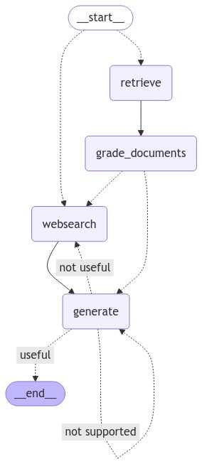

# 12. Create agents with LangGraph

This app demonstrates how to implement agents with LangGraph.

## Prerequisites

- Python 3.10 or later
- Azure OpenAI Service

## Overview

**What is [LangGraph](https://langchain-ai.github.io/langgraph/)?**

LangGraph is a library for building stateful, multi-actor applications with LLMs, used to create agent and multi-agent workflows.

This chapter provides a practical example of how to use LangGraph to create an agent that can interact with users and external tools.

## Usage

1. Get Azure OpenAI Service API key
1. Copy [.env.template](../../.env.template) to `.env` in the same directory
1. Set credentials in `.env`
1. Run main.py

```shell
# Create a virtual environment
$ python -m venv .venv

# Activate the virtual environment
$ source .venv/bin/activate

# Install dependencies
$ pip install -r requirements.txt
```

### Examples

#### [reflection_agent](https://github.com/ks6088ts-labs/workshop-azure-openai/tree/main/apps/12_langgraph_agent/reflection_agent)

#### [react_agent](https://github.com/ks6088ts-labs/workshop-azure-openai/tree/main/apps/12_langgraph_agent/react_agent)

#### [advanced_rag_flows](https://github.com/ks6088ts-labs/workshop-azure-openai/tree/main/apps/12_langgraph_agent/advanced_rag_flows)

```shell
# create vector store
python apps/12_langgraph_agent/advanced_rag_flows/ingestion.py

# run main.py
python apps/12_langgraph_agent/advanced_rag_flows/main.py
```



## References

- [LangGraph](https://langchain-ai.github.io/langgraph/)
- [Udemy > LangGraph- Develop LLM powered agents with LangGraph](https://www.udemy.com/course/langgraph)
- [emarco177/langgaph-course](https://github.com/emarco177/langgaph-course)
- [Prompt flow > Tracing](https://microsoft.github.io/promptflow/how-to-guides/tracing/index.html)
- [Reflection Agents](https://blog.langchain.dev/reflection-agents/)
- [LangChain > Reflexion](https://langchain-ai.github.io/langgraph/tutorials/reflexion/reflexion/)
- [LangChain > Bing Search](https://python.langchain.com/docs/integrations/tools/bing_search/)
