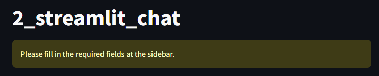

# 2. Create an Azure OpenAI Chat app using Streamlit

This app demonstrates how to create a chat application using Azure OpenAI Service and Streamlit.

## Prerequisites

- Python 3.10 or later
- Azure OpenAI Service

## Overview

In this app, you learn how to create an app with [Streamlit](https://streamlit.io/).

Streamlit is an open-source Python library that makes it easy to create and share beautiful, custom web apps for machine learning and data science projects. It allows you to build interactive applications with minimal code (only in Python!!), focusing on rapid prototyping and simplicity.

To get started, it is recommended to go through the [Streamlit documentation](https://docs.streamlit.io/get-started/installation/command-line) to create your first hello world app.

```shell
# Go to some directory
cd tmp

# Create a virtual environment
python -m venv .venv

# Activate the virtual environment
source .venv/bin/activate

# Install Streamlit
pip install streamlit

# Run the hello world python script from local file, described below
streamlit run ./hello.py
```

**Create a "Hello World" app and run it**

```python
import streamlit as st

st.write("Hello world")
```

To go further, you can refer to the [API reference](https://docs.streamlit.io/develop/api-reference) to understand the different components and functionalities available in Streamlit. You can also refer to the [Streamlit Cheat Sheet](https://docs.streamlit.io/develop/quick-reference/cheat-sheet). There are many examples and tutorials available on the Streamlit website.

**Create a chat application**

For implementing the chat application, you can refer to the [Streamlit Chat](https://streamlit.io/generative-ai) example below.
This app uses the OpenAI API to create a chatbot that can chat with users. The chatbot uses the GPT-3.5-turbo model to generate responses.

```python
import streamlit as st
from openai import OpenAI

with st.sidebar:
    openai_api_key = st.text_input("OpenAI API Key", key="chatbot_api_key", type="password")
    "[Get an OpenAI API key](https://platform.openai.com/account/api-keys)"
    "[View the source code](https://github.com/streamlit/llm-examples/blob/main/Chatbot.py)"
    "[](https://codespaces.new/streamlit/llm-examples?quickstart=1)"

st.title("💬 Chatbot")

if "messages" not in st.session_state:
    st.session_state["messages"] = [{"role": "assistant", "content": "How can I help you?"}]

for msg in st.session_state.messages:
    st.chat_message(msg["role"]).write(msg["content"])

if prompt := st.chat_input():
    if not openai_api_key:
        st.info("Please add your OpenAI API key to continue.")
        st.stop()

    client = OpenAI(api_key=openai_api_key)
    st.session_state.messages.append({"role": "user", "content": prompt})
    st.chat_message("user").write(prompt)
    response = client.chat.completions.create(model="gpt-3.5-turbo", messages=st.session_state.messages)
    msg = response.choices[0].message.content
    st.session_state.messages.append({"role": "assistant", "content": msg})
    st.chat_message("assistant").write(msg)
```

### **_Exercise: Convert OpenAI API to Azure OpenAI Service_**

In this exercise, please convert the OpenAI API to the Azure OpenAI Service API with the knowledge you have gained from the previous chapter [1_call_azure_openai_chat](../1_call_azure_openai_chat/README.md).

## Usage

1. Get Azure OpenAI Service API key
1. Copy [.env.template](../../.env.template) to `.env` in the same directory
1. Set credentials in `.env`
1. Run [main.py](./main.py)

```shell
# Create a virtual environment
$ python -m venv .venv

# Activate the virtual environment
$ source .venv/bin/activate

# Install dependencies
$ pip install -r requirements.txt

# Run the script
$ python -m streamlit run apps/2_streamlit_chat/main.py
```

### Example

When you access `http://localhost:8501`, you will see the following screen.



To start a conversation, fill in the required fields in the sidebar and you will see the following screen.


## Note

This app uses `st.session_state.messages` to store messages for chat. This is a mechanism to store messages per session on the process side of the application. Messages will disappear when the session ends.
