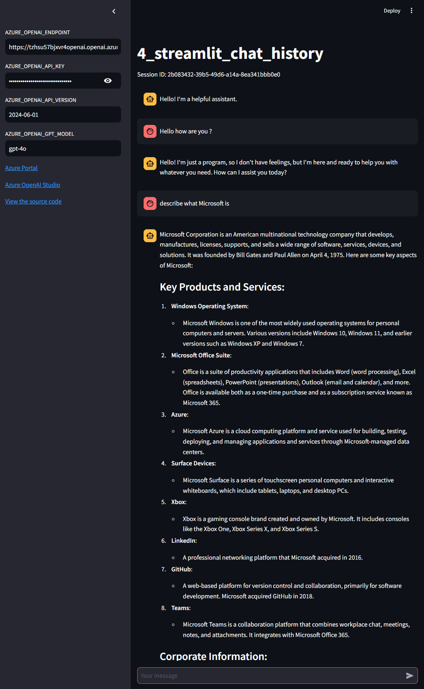
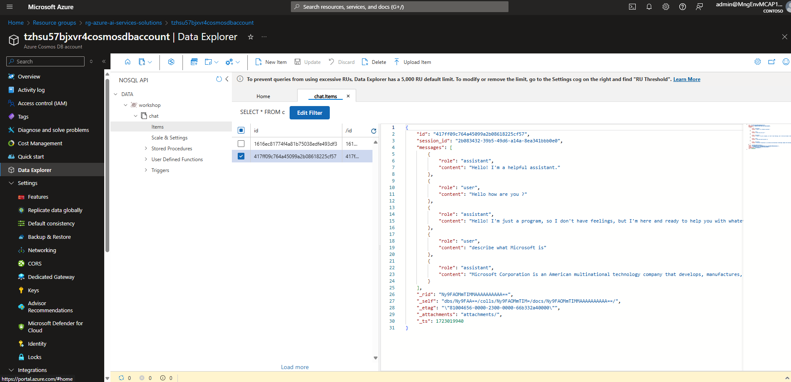

# 4. Add feature to store chat history using Azure Cosmos DB

This app demonstrates how to add a feature to save chat history using Azure Cosmos DB to an Azure OpenAI Chat app using Streamlit implemented in [2_streamlit_chat](../2_streamlit_chat/).

## Prerequisites

- Python 3.10 or later
- Azure OpenAI Service
- Azure Cosmos DB

## Usage

1. Get Azure OpenAI Service API key
1. Get the connection string for Azure Cosmos DB
1. Copy [.env.template](../../.env.template) to `.env` in the same directory
1. Set credentials in `.env`
1. Run [main.py](./main.py)

```shell
# Create a virtual environment
$ python -m venv .venv

# Activate the virtual environment
$ source .venv/bin/activate

# Install dependencies
$ pip install -r requirements.txt

# Run the script
$ python -m streamlit run apps/4_streamlit_chat_history/main.py
```

### Example

Access `http://localhost:8501` and set the required fields in the sidebar to start a conversation.

When you send a message, the chat history will be saved in Azure Cosmos DB.



Conversation history can be viewed from the Cosmos DB Data Explorer as shown below.



The chat history is saved as shown below.

**Conversation #1**

```json
{
  "id": "1616ec81774f4a81b75038edfe493df3",
  "session_id": "2b083432-39b5-49d6-a14a-8ea341bbb0e0",
  "messages": [
    {
      "role": "assistant",
      "content": "Hello! I'm a helpful assistant."
    },
    {
      "role": "user",
      "content": "Hello how are you ?"
    },
    {
      "role": "assistant",
      "content": "Hello! I'm just a program, so I don't have feelings, but I'm here and ready to help you with whatever you need. How can I assist you today?"
    }
  ],
  "_rid": "Ny9FAOMmTIMLAAAAAAAAAA==",
  "_self": "dbs/Ny9FAA==/colls/Ny9FAOMmTIM=/docs/Ny9FAOMmTIMLAAAAAAAAAA==/",
  "_etag": "\"8100214b-0000-2300-0000-66b331fe0000\"",
  "_attachments": "attachments/",
  "_ts": 1723019774
}
```

**Conversation #2**

```json
{
  "id": "417ff09c764a45099a2b08618225cf57",
  "session_id": "2b083432-39b5-49d6-a14a-8ea341bbb0e0",
  "messages": [
    {
      "role": "assistant",
      "content": "Hello! I'm a helpful assistant."
    },
    {
      "role": "user",
      "content": "Hello how are you ?"
    },
    {
      "role": "assistant",
      "content": "Hello! I'm just a program, so I don't have feelings, but I'm here and ready to help you with whatever you need. How can I assist you today?"
    },
    {
      "role": "user",
      "content": "describe what Microsoft is"
    },
    {
      "role": "assistant",
      "content": "Microsoft Corporation is an American multinational technology company that develops, manufactures, licenses, supports, and sells a wide range of software, services, devices, and solutions. It was founded by Bill Gates and Paul Allen on April 4, 1975. Here are some key aspects of Microsoft:\n\n### Key Products and Services:\n\n1. **Windows Operating System**:\n   - Microsoft Windows is one of the most widely used operating systems for personal computers and servers. Various versions include Windows 10, Windows 11, and earlier versions such as Windows XP and Windows 7.\n\n2. **Microsoft Office Suite**:\n   - Office is a suite of productivity applications that includes Word (word processing), Excel (spreadsheets), PowerPoint (presentations), Outlook (email and calendar), and more. Office is available both as a one-time purchase and as a subscription service known as Microsoft 365.\n\n3. **Azure**:\n   - Microsoft Azure is a cloud computing platform and service used for building, testing, deploying, and managing applications and services through Microsoft-managed data centers.\n\n4. **Surface Devices**:\n   - Microsoft Surface is a series of touchscreen personal computers and interactive whiteboards, which include tablets, laptops, and desktop PCs.\n\n5. **Xbox**:\n   - Xbox is a gaming console brand created and owned by Microsoft. It includes consoles like the Xbox One, Xbox Series X, and Xbox Series S.\n\n6. **LinkedIn**:\n   - A professional networking platform that Microsoft acquired in 2016.\n\n7. **GitHub**:\n   - A web-based platform for version control and collaboration, primarily for software development. Microsoft acquired GitHub in 2018.\n\n8. **Teams**:\n   - Microsoft Teams is a collaboration platform that combines workplace chat, meetings, notes, and attachments. It integrates with Microsoft Office 365.\n\n### Corporate Information:\n- **Headquarters**: Redmond, Washington, USA\n- **CEO**: As of the last update, Satya Nadella (took over the role in 2014)\n\n### Innovations and Contributions:\n- **Artificial Intelligence (AI)** and **Machine Learning (ML)** solutions.\n- **Quantum Computing** research and development.\n- Investments in educational tools and initiatives.\n- Various contributions to open source software.\n\nOverall, Microsoft is a key player in the tech industry, contributing significantly to various technological advancements and offering a wide array of products and services that impact both consumers and businesses around the world."
    }
  ],
  "_rid": "Ny9FAOMmTIMMAAAAAAAAAA==",
  "_self": "dbs/Ny9FAA==/colls/Ny9FAOMmTIM=/docs/Ny9FAOMmTIMMAAAAAAAAAA==/",
  "_etag": "\"81004656-0000-2300-0000-66b332a40000\"",
  "_attachments": "attachments/",
  "_ts": 1723019940
}
```
