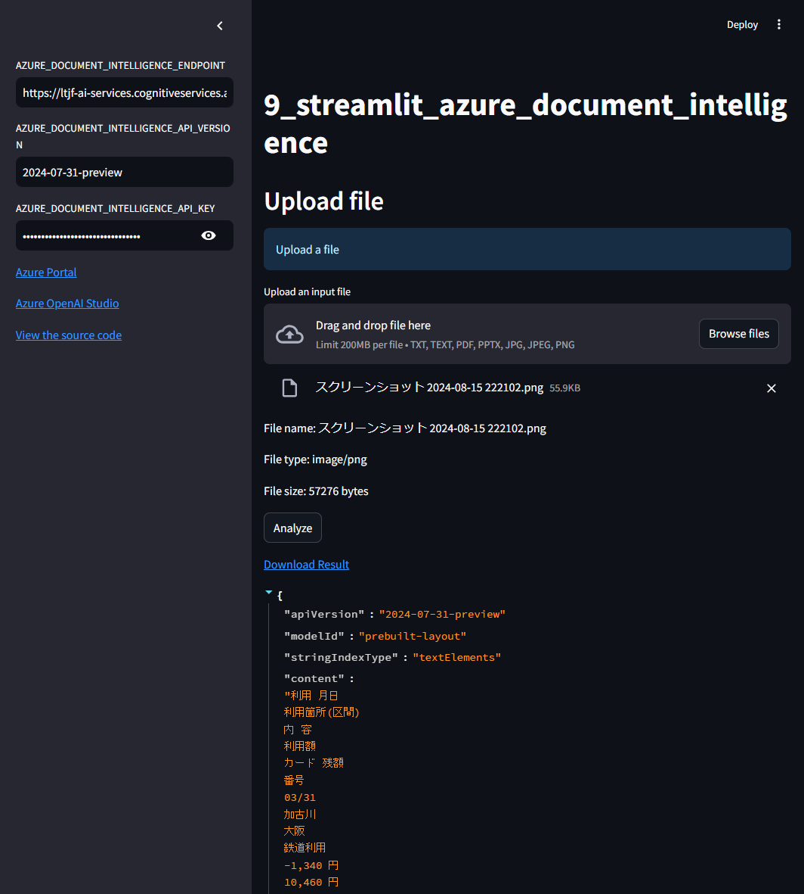

# 9. Call Azure Document Intelligence API with Streamlit

This Streamlit app demonstrates how to call Azure Document Intelligence API with Streamlit.

## Prerequisites

- Python 3.10 or later
- Azure Document Intelligence API key

## Usage

1. Get Azure Document Intelligence API key
1. Copy [.env.template](../../.env.template) to `.env` in the same directory
1. Set credentials in `.env`
1. Run [main.py](./main.py)

```shell
# Create a virtual environment
$ python -m venv .venv

# Activate the virtual environment
$ source .venv/bin/activate

# Install dependencies
$ pip install -r requirements.txt

# Run the script
$ python -m streamlit run apps/9_streamlit_azure_document_intelligence/main.py
```

### Example



## References

- [Azure AI Document Intelligence client library for Python - version 1.0.0b3](https://learn.microsoft.com/en-us/python/api/overview/azure/ai-documentintelligence-readme?view=azure-python-preview)
