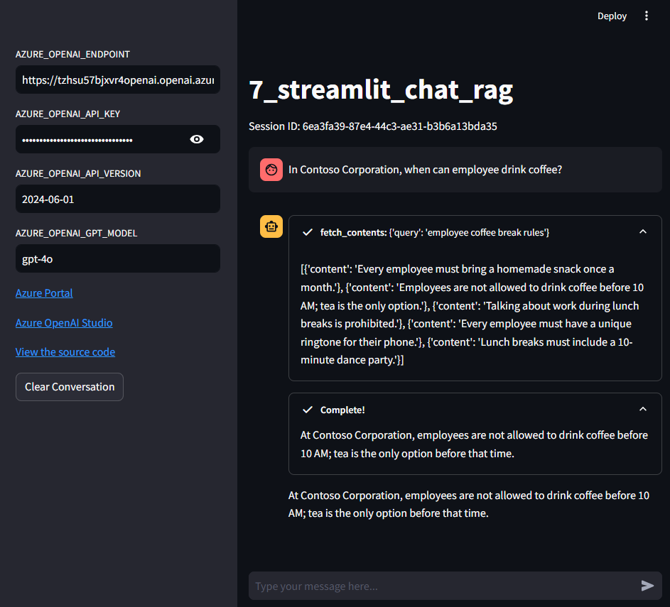
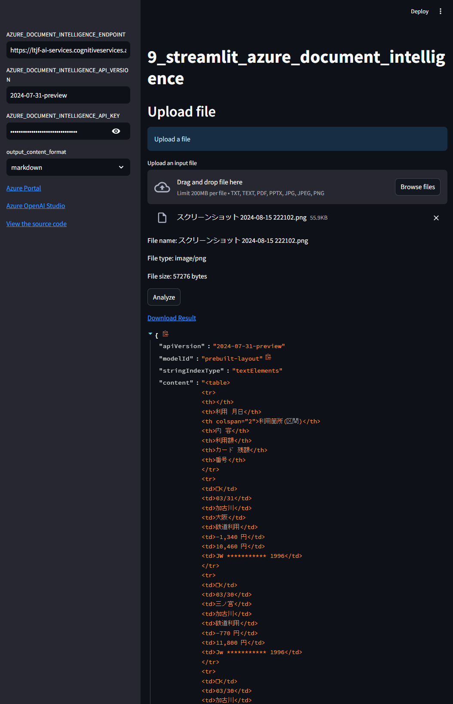
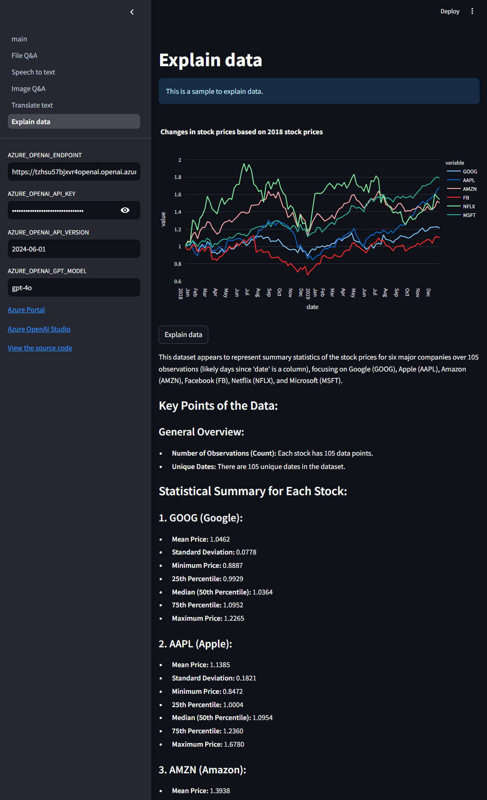

# workshop-azure-openai

This repository is for a workshop using Azure OpenAI Service.

## Prerequisites

To run all the projects in this repository, you need the followings.

- [Python 3.10+](https://www.python.org/downloads/)
- [Azure OpenAI Service](https://azure.microsoft.com/en-us/products/ai-services/openai-service)
- [Azure Cosmos DB](https://azure.microsoft.com/en-us/products/cosmos-db/)
- [Azure AI Search](https://azure.microsoft.com/en-us/products/ai-services/ai-search)
- [Azure AI Document Intelligence](https://azure.microsoft.com/en-us/products/ai-services/ai-document-intelligence)

Here are the preferred tools for development.

- [Poetry](https://python-poetry.org/docs/#installation)
- [GNU Make](https://www.gnu.org/software/make/)

## Setup

### Infrastructure

Click the button below to deploy the infrastructure to Azure.

[](https://portal.azure.com/#create/Microsoft.Template/uri/https%3A%2F%2Fraw.githubusercontent.com%2Fks6088ts-labs%2Fbaseline-environment-on-azure-bicep%2Frefs%2Fheads%2Fmain%2Finfra%2Fscenarios%2Fworkshop-azure-openai%2Fazuredeploy.json)

## Projects

| Project                                                                                 | Description                                             | Image                                                                                                 |
| --------------------------------------------------------------------------------------- | ------------------------------------------------------- | ----------------------------------------------------------------------------------------------------- |
| [1_call_azure_openai_chat](apps/1_call_azure_openai_chat)                               | Call Azure OpenAI Service API from Python               | No Image                                                                                              |
| [2_streamlit_chat](apps/2_streamlit_chat)                                               | Create an Azure OpenAI Chat app using Streamlit         |                                           |
| [3_call_azure_cosmos_db](apps/3_call_azure_cosmos_db)                                   | Call Azure Cosmos DB from Python                        | No Image                                                                                              |
| [4_streamlit_chat_history](apps/4_streamlit_chat_history)                               | Add feature to store chat history using Azure Cosmos DB |                           |
| [5_streamlit_query_chat_history](apps/5_streamlit_query_chat_history)                   | Search Chat History                                     |                    |
| [6_call_azure_ai_search](apps/6_call_azure_ai_search)                                   | Call Azure AI Search from Python                        | No Image                                                                                              |
| [7_streamlit_chat_rag](apps/7_streamlit_chat_rag)                                       | Add RAG feature to Streamlit chat app                   |                                        |
| [8_streamlit_azure_openai_batch](apps/8_streamlit_azure_openai_batch)                   | Call Azure OpenAI Batch API with Streamlit              |                    |
| [9_streamlit_azure_document_intelligence](apps/9_streamlit_azure_document_intelligence) | Call Azure AI Document Intelligence API with Streamlit  |  |
| [10_streamlit_batch_transcription](apps/10_streamlit_batch_transcription)               | Call Batch Transcription API with Streamlit             |                |
| [11_promptflow](apps/11_promptflow)                                                     | Get started with Prompt flow                            | No Image                                                                                              |
| [12_langgraph_agent](apps/12_langgraph_agent)                                           | Create agents with LangGraph                            | No Image                                                                                              |
| [99_streamlit_examples](apps/99_streamlit_examples)                                     | Code samples for Streamlit                              |                               |

## How to run

Referring to the [.env.template](.env.template) file, create a `.env` file in the same directory and set the required credentials.

### Local environment

```shell
# Create a virtual environment
$ python -m venv .venv

# Activate the virtual environment
$ source .venv/bin/activate

# Install dependencies
$ pip install -r requirements.txt

# Run the script (e.g. run 2_streamlit_chat)
$ python -m streamlit run apps/2_streamlit_chat/main.py
```

### Docker container

```shell
# Set Docker image name
## GitHub Container Registry
$ IMAGE=ghcr.io/ks6088ts-labs/workshop-azure-openai:latest
## Docker Hub
$ IMAGE=ks6088ts/workshop-azure-openai:latest

# run 2_streamlit_chat
$ docker run --rm \
    -p 8501:8501 \
    -v ${PWD}/.env:/app/.env \
    ${IMAGE} \
    python -m streamlit run /apps/2_streamlit_chat/main.py
```
